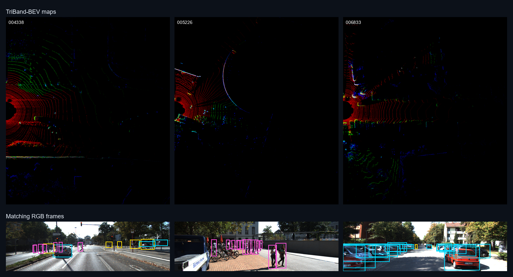
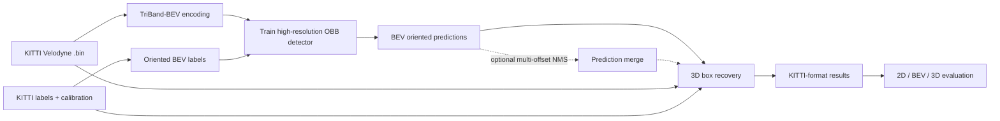
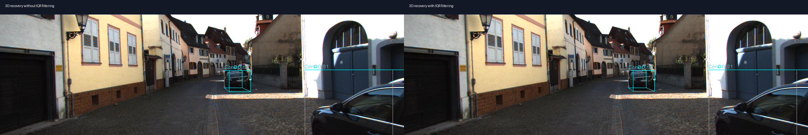
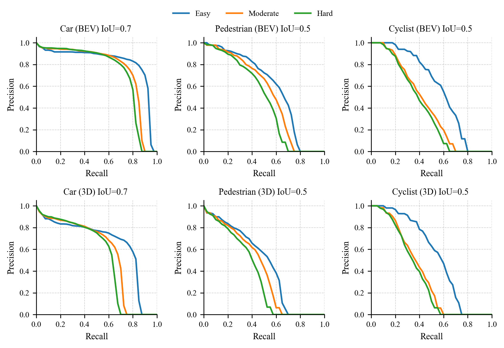

# TriBand-BEV

<p align="center">
  <strong>Real-time LiDAR-only 3D object detection by learning height-aware BEV encodings.</strong><br>
  KITTI point clouds -> TriBand-BEV maps -> oriented BEV footprints -> KITTI-format 3D boxes.
</p>

<p align="center">
  <a href="https://github.com/mohammadkhsh/TriBand-BEV"></a>
  
  
  
</p>


<p align="center">
  <a href="https://arxiv.org/abs/2605.12220"></a>
</p>

> If you use this repository, code, figures, or method description, please cite our paper. Citation details are available at the end of this README.

<p align="center">
  
</p>

## Motivation

- Urban robots and autonomous vehicles need fast, reliable, LiDAR-only perception that works under real-time compute and power limits.
- Camera-LiDAR fusion and full 3D LiDAR models can be heavy, memory intensive, and difficult to deploy on edge hardware.
- TriBand-BEV compresses the full 3D LiDAR scene into a normal RGB-like BEV image, so efficient 2D oriented detectors can process it directly.

## What this repository does

TriBand-BEV converts KITTI LiDAR point clouds into compact 2D bird's-eye-view tensors and trains a high-resolution oriented detector to find Cars, Pedestrians, and Cyclists. The detector predicts rotated 2D footprints on the BEV plane. A geometry post-processor then recovers KITTI-format 3D bounding boxes by expanding each footprint, selecting the corresponding LiDAR points, estimating the bottom and top plates, filtering noisy height candidates with IQR, and projecting the recovered box back to the camera frame.

The important correction: the detection pipeline is LiDAR-only. KITTI camera calibration is used for label conversion, coordinate transforms, and 2D projection during 3D recovery/evaluation; camera images are not required as detector input.



## Core ideas

- **TriBand-BEV encoding:** discretizes the forward LiDAR field of view into a 700 x 800 BEV map at 0.10 m/cell over `x=[0,70] m`, `y=[-40,40] m`.
- **Height-aware channels:** each RGB channel stores the strongest reflectance response in a vertical band after LiDAR height normalization: low, middle, and high.
- **High-resolution fusion:** the detector head uses P1-P4 feature maps so small BEV footprints, especially pedestrians, keep enough spatial detail.
- **Optional multi-offset robustness:** validation/test encodings can be generated with `z_offset` shifts of `-0.3 m`, `0 m`, and `+0.3 m`, then merged with 0.5 IoU polygon NMS. This gives only minimal AP gains while roughly tripling BEV inference work, so the single-offset path is the recommended default.
- **Geometry-only 3D recovery:** no learned depth head is needed; 3D boxes are reconstructed from the predicted BEV footprint and the original point cloud.

## Repository layout

Only these parts are needed for a clean public release. Most older ablation folders, one-off visualizers, license-plate experiments, and external test repositories can be left out.

| Path | Purpose |
|---|---|
| `scripts/build_triband_bev.py` | Builds TriBand-BEV images and oriented BEV labels from KITTI LiDAR, labels, and calibration. |
| `configs/triband_obb_detector_m.yaml` | High-resolution oriented detector architecture used by the final model. |
| `configs/kitti_triband.yaml` | Dataset config for the KITTI TriBand-BEV train/validation folders. |
| `scripts/train_detector.py` | Training entry point. Edit paths/config here before running a new experiment. |
| `scripts/export_bev_predictions.py` | Saves detector predictions as normalized BEV polygons plus visualization images. |
| `scripts/filter_multi_offset_predictions.py` | Merges `base`, `pos30`, and `neg30` prediction files and applies 0.5 polygon NMS. |
| `scripts/recover_3d_boxes.py` | Converts filtered BEV footprints into KITTI-format 3D detections. |
| `scripts/evaluate_kitti.py` | Local KITTI-style 2D, BEV, and 3D evaluation with PR curve export. |
| `result_final_inter.py` | Summarizes AP from exported PR-curve text files. |
| `train_idx.txt`, `val_idx.txt` | KITTI train/validation split used in the experiments. |
| `docs/assets/` | README figures copied from current outputs. |

## Setup

Clone the repository and install the Python dependencies in a fresh environment.

```bash
git clone https://github.com/mohammadkhsh/TriBand-BEV.git
cd TriBand-BEV
python -m venv .venv
# Windows PowerShell:
.venv\Scripts\Activate.ps1
# Linux/macOS:
# source .venv/bin/activate

pip install --upgrade pip
pip install numpy opencv-python imageio pillow matplotlib pandas tabulate shapely ultralytics torch torchvision
```

Expected KITTI layout:

```text
TriBand-BEV/
|-- lidar/training/velodyne/        # KITTI .bin point clouds
|-- labels/training/label_2/        # KITTI labels
|-- calibration/training/calib/     # KITTI calibration files
|-- train_idx.txt
`-- val_idx.txt
```

## Run the pipeline

Most current scripts use fixed paths near the top of the file. Before running, verify the input/output directories inside each script match your local dataset layout.

### 1. Generate TriBand-BEV encodings and oriented labels

```bash
python scripts/build_triband_bev.py
```

This reads:

```text
lidar/training/velodyne/
labels/training/label_2/
calibration/training/calib/
train_idx.txt
val_idx.txt
```

and writes BEV images/labels under the configured experiment directory. If enabled, validation frames can also receive `*_pos30` and `*_neg30` variants for multi-offset inference, but this is optional and not recommended for the default real-time setting.

### 2. Train the oriented BEV detector

Check `scripts/train_detector.py` and `configs/kitti_triband.yaml` before launching training. The default training profile uses:

```text
epochs=400, imgsz=800, batch=32, device=0, amp=True, iou=0.7, patience=75
```

Run:

```bash
python scripts/train_detector.py
```

Minimal dataset YAML:

```yaml
train: images/train
val: images/val
nc: 3
names: ["Car", "Pedestrian", "Cyclist"]
```

### 3. Export BEV footprint predictions

Edit the constants in `scripts/export_bev_predictions.py` or in its underlying implementation:

```python
MODEL_PATH = "best_newset_full-s.pt"
VAL_IMAGES_DIR = "<experiment>/images/val"
SAVE_TXT_DIR = "pedestrian_detect_bev_new/txt/"
SAVE_IMG_DIR = "pedestrian_detect_bev_new/images/"
CONF_THRES = 0.01
IOU_THRES = 0.5
DEVICE = "0"
```

Run:

```bash
python scripts/export_bev_predictions.py
```

Prediction text format:

```text
<class_id> <confidence> <x1> <y1> <x2> <y2> <x3> <y3> <x4> <y4>
```

All coordinates are normalized to the BEV image frame.

### 4. Optional: merge multi-offset predictions with polygon NMS

The recommended default is to skip this step and use the single-offset predictions directly. Multi-offset inference gives very small performance gains in the paper, but it requires about three BEV forward passes and therefore more processing power. If you still generate triplets such as `000008.txt`, `000008_pos30.txt`, and `000008_neg30.txt`, merge them with:

```bash
python scripts/filter_multi_offset_predictions.py \
  --input "<experiment>/predictions_3offset" \
  --output "<experiment>/predictions_3offset_filtered" \
  --iou-threshold 0.5
```

The output folder contains one merged file per frame, for example `000008.txt`.

### 5. Recover 3D boxes from BEV footprints

Edit the paths in `scripts/recover_3d_boxes.py` or in its underlying implementation if needed:

```python
pred_dir = Path("<experiment>/predictions_3offset_filtered")
velo_dir = Path("lidar/training/velodyne")
calib_dir = Path("calibration/training/calib")
out_dir = Path("results/new-data-full-s-New-3layer")
```

Run:

```bash
python scripts/recover_3d_boxes.py
```

The recovered detections are saved in KITTI result format:

```text
<Class> -1 -1 -10 <x1> <y1> <x2> <y2> <h> <w> <l> <tx> <ty> <tz> <ry> <score>
```

3D recovery logic:

1. De-normalize the BEV polygon to Velodyne XY meters.
2. Expand the footprint when point support is sparse or distance is large.
3. Select LiDAR points inside the original and expanded footprints.
4. Estimate `z_bottom` from the lowest in-footprint points.
5. Estimate `z_top` from the highest in-footprint points.
6. Apply IQR filtering to suppress isolated outlier points.
7. Recover `h, w, l, tx, ty, tz, ry` and project the 3D box into the image plane.

<p align="center">
  
</p>

### 6. Evaluate on KITTI validation

Local evaluator:

```bash
python scripts/evaluate_kitti.py
python result_final_inter.py
```

Alternative evaluator in `kitti-object-eval-python-master`:

```bash
cd kitti-object-eval-python-master
python evaluate.py evaluate \
  --label_path=../labels/training/label_2 \
  --result_path=../results/new-data-full-s-New-3layer \
  --label_split_file=val_idx.txt \
  --current_class=0 \
  --coco=False
```

If the CUDA-based rotated-IoU evaluator fails on Windows, first verify the environment with:

```bash
python -c "from numba import cuda; print(cuda.is_available()); cuda.detect()"
```

Then clear stale Numba cache if needed:

```bash
rm -rf ~/.numba_cache
find . -type d -name "__pycache__" -prune -exec rm -rf {} +
```

## Results from the paper

Evaluation follows KITTI 40 recall positions with class-specific IoU thresholds: Car `0.7`, Pedestrian `0.5`, Cyclist `0.5`.

### Pedestrian comparison

| Method | BEV AP@0.5 Easy | BEV AP@0.5 Mod. | BEV AP@0.5 Hard | 3D AP@0.5 Easy | 3D AP@0.5 Mod. | 3D AP@0.5 Hard | FPS |
|---|---:|---:|---:|---:|---:|---:|---:|
| Complex baseline | 46.08 | 45.09 | 44.20 | 41.79 | 39.70 | 35.92 | 50 |
| TriBand-BEV | **58.72** | **52.68** | **47.27** | **45.91** | **40.83** | 35.64 | 49 |

### Full-class KITTI AP

| Class | Space | IoU | Easy | Moderate | Hard |
|---|---|---:|---:|---:|---:|
| Car | BEV | 0.7 | 81.74 | 75.42 | 72.57 |
| Car | 3D | 0.7 | 65.32 | 56.58 | 52.99 |
| Pedestrian | BEV | 0.5 | 58.72 | 52.68 | 47.27 |
| Pedestrian | 3D | 0.5 | 45.91 | 40.83 | 35.64 |
| Cyclist | BEV | 0.5 | 57.90 | 41.77 | 39.04 |
| Cyclist | 3D | 0.5 | 54.00 | 36.54 | 34.50 |

### Ablation summary

Values are mean AP over easy/moderate/hard in percent.

| Base width | Aug. | Head levels | Car BEV | Car 3D | Ped. BEV | Ped. 3D | Cyc. BEV | Cyc. 3D |
|---:|:---:|---|---:|---:|---:|---:|---:|---:|
| 16 | No | D32, D16, B8 | 70.32 | 50.97 | 29.87 | 25.81 | 31.94 | 26.38 |
| 16 | Yes | D32, D16, B8 | 76.19 | 57.20 | 39.47 | 29.64 | 26.51 | 21.52 |
| 32 | Yes | D32, D16, B8 | 76.26 | 57.46 | 37.94 | 28.83 | 37.96 | 32.83 |
| 32 | Yes | D16, D8, D4, B2 | **76.58** | **58.30** | **52.89** | **40.79** | **46.24** | **41.68** |

<p align="center">
  
</p>

## Practical notes

- The current codebase contains many exploratory files. For a clean GitHub release, keep the pipeline files listed above and move old ablations into an `archive/` folder or omit them.
- Large model weights (`*.pt`, `*.onnx`, `*.pth`) should usually be published through GitHub Releases, Hugging Face, or another artifact host instead of committed directly.
- KITTI data should not be committed. Document the expected folder structure and require users to download KITTI separately.
- The public scripts should eventually be refactored to use command-line arguments instead of hardcoded paths; the commands above describe the current local layout.

## Citation

```bibtex
@inproceedings{khoshkdahan2026tribandbev,
  title     = {TriBand-BEV: Real-Time LiDAR-Only 3D Pedestrian Detection via Height-Aware BEV and High-Resolution Feature Fusion},
  author    = {Khoshkdahan, Mohammad and Vinel, Alexey},
  booktitle = {Proceedings of the 25th International Conference on Autonomous Agents and Multiagent Systems (AAMAS)},
  pages     = {1294--1303},
  year      = {2026}
}
```
